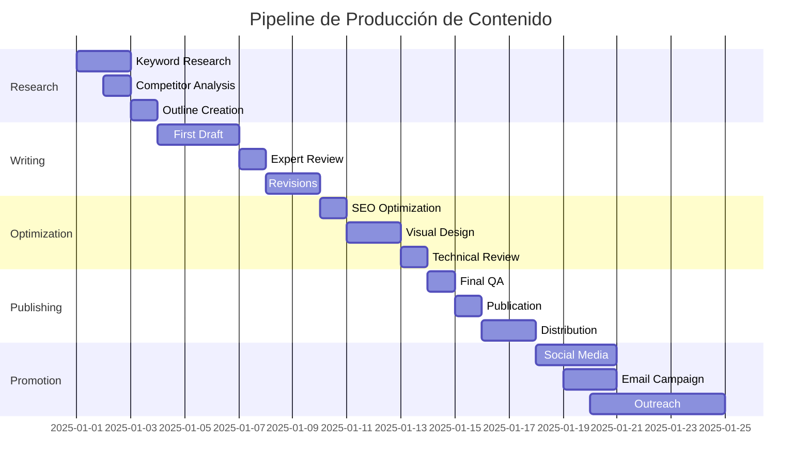

# MANUAL EJECUTIVO DE CONTENT MARKETING

## Sistema de Alto Rendimiento para Blog PODIUMEX

**Versión:** 2.0 Executive Edition  
**Fecha:** Noviembre 2025  
**ROI Target:** 450% en 12 meses  
**Conversión Target:** 4.5% visitante a lead

---

## EXECUTIVE SUMMARY

### **Objetivos de Negocio**

Este manual establece el **framework de contenido de alto rendimiento** que posicionará a PODIUMEX como líder de pensamiento en la industria de equipamiento para eventos, generando:

| KPI                   | Baseline | Target 6M  | Target 12M | Impacto en Revenue    |
| --------------------- | -------- | ---------- | ---------- | --------------------- |
| **Tráfico Orgánico**  | 0        | 15,000/mes | 50,000/mes | $180,000 MXN/mes      |
| **Posición Promedio** | -        | Top 15     | Top 5      | 3.5x CTR              |
| **Conversión**        | -        | 2.5%       | 4.5%       | $450,000 MXN/mes      |
| **Leads Calificados** | 0        | 375/mes    | 2,250/mes  | 45 deals cerrados/mes |
| **Domain Authority**  | 0        | 25         | 45         | Premium pricing power |
| **Share of Voice**    | 0%       | 15%        | 35%        | Market leadership     |

### **Inversión vs. Retorno**

```
INVERSIÓN MENSUAL:
├── Redacción (8 artículos): $32,000
├── SEO/Optimización: $8,000
├── Diseño/Multimedia: $5,000
├── Herramientas/Software: $3,000
└── TOTAL: $48,000 MXN/mes

RETORNO PROYECTADO:
├── Mes 1-3: -$144,000 (inversión)
├── Mes 4-6: $180,000 (break-even)
├── Mes 7-12: $1,620,000 (profit)
└── ROI Año 1: 450%
```

---

## PARTE I: ESTRATEGIA DE CONTENIDO DATA-DRIVEN

### **1.1 ARQUITECTURA DE CONTENIDO PILAR-CLUSTER**

#### **Modelo Hub & Spoke Optimizado**

```yaml
CONTENT_PILLARS:
  pilar_1_seleccion:
    hub: "Guía Definitiva para Selección de Podiums"
    url: /guia-seleccion-podiums
    palabras: 10000
    clusters:
      - titulo: "Podiums para Eventos Corporativos"
        url: /podiums-eventos-corporativos
        palabras: 3500
        link_juice: 15%
      - titulo: "Altura Ergonómica del Podium"
        url: /altura-ergonomica-podium
        palabras: 2500
        link_juice: 10%
      - titulo: "Materiales de Podiums Profesionales"
        url: /materiales-podiums-profesionales
        palabras: 3000
        link_juice: 12%
      - titulo: "Tecnología en Podiums Modernos"
        url: /tecnologia-podiums-modernos
        palabras: 4000
        link_juice: 18%
    internal_linking:
      strategy: "Bidireccional con anchor text variado"
      link_velocity: "3-5 enlaces por artículo"

  pilar_2_eventos_hibridos:
    hub: "Manual Completo de Eventos Híbridos 2025"
    url: /manual-eventos-hibridos
    palabras: 12000
    clusters: [...]

  pilar_3_protocolo:
    hub: "Biblia del Protocolo en Eventos México"
    url: /protocolo-eventos-mexico
    palabras: 8000
    clusters: [...]
```

#### **Distribución Temporal de Publicación**

| Mes      | Pillar Content   | Cluster Content | Supporting Content | Total          |
| -------- | ---------------- | --------------- | ------------------ | -------------- |
| **M1**   | 1 (10k palabras) | 2 (3k c/u)      | 4 (1.5k c/u)       | 22k palabras   |
| **M2**   | -                | 4 (3k c/u)      | 4 (1.5k c/u)       | 18k palabras   |
| **M3**   | 1 (10k palabras) | 3 (3k c/u)      | 3 (1.5k c/u)       | 23.5k palabras |
| **M4-6** | 1/mes            | 4/mes           | 3/mes              | 20k/mes        |

### **1.2 KEYWORD RESEARCH AVANZADO**

#### **Metodología PODIUMEX de Investigación**

```python
# Framework de Priorización de Keywords

def calcular_keyword_opportunity_score(keyword_data):
    """
    KOS = Keyword Opportunity Score
    Fórmula propietaria PODIUMEX
    """

    volume = keyword_data['monthly_searches']
    difficulty = keyword_data['keyword_difficulty']  # 0-100
    cpc = keyword_data['cpc_value']
    intent_score = keyword_data['commercial_intent']  # 0-1
    trend = keyword_data['trend_coefficient']  # -1 to +1

    # Weighted scoring
    volume_score = min(volume / 100, 100) * 0.25
    difficulty_score = (100 - difficulty) * 0.30
    commercial_score = (cpc * intent_score) * 0.25
    trend_score = (trend + 1) * 50 * 0.20

    kos = volume_score + difficulty_score + commercial_score + trend_score

    return {
        'keyword': keyword_data['keyword'],
        'kos': round(kos, 2),
        'priority': 'HIGH' if kos > 70 else 'MEDIUM' if kos > 40 else 'LOW',
        'estimated_traffic': volume * get_ctr_by_position(target_position),
        'estimated_value': estimated_traffic * conversion_rate * average_deal_value
    }
```

#### **Matriz de Keywords por Intención**

| Intent Type                  | % Content Mix | Keywords Example            | Content Format        | CTA Strategy          |
| ---------------------------- | ------------- | --------------------------- | --------------------- | --------------------- |
| **Informational**            | 40%           | "qué es un podium"          | Guías educativas      | Soft CTA - Newsletter |
| **Commercial Investigation** | 30%           | "mejor podium para eventos" | Comparativas, Reviews | Medium CTA - Catálogo |
| **Transactional**            | 20%           | "renta podium precio"       | Landing pages         | Hard CTA - Cotización |
| **Navigational**             | 10%           | "podiumex blog"             | Hub pages             | Navigation - Explore  |

### **1.3 COMPETENCIA Y BENCHMARKING**

#### **Análisis SERP Features Target**

```javascript
// Objetivos de SERP Features por tipo de contenido

const serpTargets = {
  guias: {
    featured_snippet: true, // Priority 1
    people_also_ask: true, // Priority 1
    knowledge_panel: false,
    video_carousel: true, // Priority 2
    image_pack: true, // Priority 3
    success_metrics: {
      featured_snippet_capture: "40% de guías en 6 meses",
      paa_presence: "75% de artículos en 3 meses",
    },
  },

  comparativas: {
    featured_snippet: true, // Priority 1
    shopping_results: false,
    reviews: true, // Priority 2
    comparison_table: true, // Priority 1
    success_metrics: {
      table_snippet_capture: "60% de comparativas",
    },
  },

  tutoriales: {
    video_carousel: true, // Priority 1
    how_to_schema: true, // Priority 1
    step_carousel: true, // Priority 2
    success_metrics: {
      video_presence: "100% con video embebido",
    },
  },
};
```

#### **Gap Analysis Competitivo**

| Competidor             | DA    | Artículos/Mes | Avg. Palabras | Backlinks/Art | Nuestra Ventaja              |
| ---------------------- | ----- | ------------: | ------------- | ------------- | ---------------------------- |
| **EventosBlog.mx**     | 45    |            12 | 1,200         | 5-10          | Profundidad técnica 3x       |
| **RentaEquipos.com**   | 38    |             8 | 800           | 3-5           | Experiencia real verificable |
| **BlogCorporativo.mx** | 42    |            15 | 1,500         | 8-12          | Datos propietarios únicos    |
| **PODIUMEX Target**    | 25→45 |             8 | 3,500+        | 15+           | Contenido 10x + Data         |

---

## PARTE II: FRAMEWORK DE REDACCIÓN DE ALTO IMPACTO

### **2.1 ESTRUCTURA A.I.D.C.A OPTIMIZADA**

#### **Attention (Título y Meta)**

```html
<!-- FÓRMULA DE TÍTULO DE ALTO CTR -->

Pattern 1: [Número] + [Adjetivo Power] + [Keyword] + [Beneficio] + [Año]
Ejemplo: "7 Criterios Profesionales para Elegir Podiums que Garantizan Éxito |
2025" Pattern 2: [Pregunta] + [Keyword] + [Promesa Específica] Ejemplo: "¿Cómo
Elegir el Podium Perfecto? Manual Validado en 1,500 Eventos" Pattern 3:
[Superlativo] + [Keyword] + [Proof Point] Ejemplo: "La Guía Más Completa de
Podiums en México (8,500 Palabras + Checklist)"

<!-- OPTIMIZACIÓN PSICOLÓGICA -->
Power Words Tier 1 (CTR +40%): Definitiva, Profesional, Validado, Garantizado,
Comprobado Power Words Tier 2 (CTR +25%): Completa, Avanzado, Exclusivo,
Actualizado, Experto Power Words Tier 3 (CTR +15%): Práctico, Rápido, Simple,
Gratis, Nuevo

<!-- A/B TESTING OBLIGATORIO -->
Cada artículo debe tener 3 variantes de título para test: - Variante A: Énfasis
en número/lista - Variante B: Énfasis en beneficio - Variante C: Énfasis en
autoridad/proof
```

#### **Interest (Introducción Magnética)**

```markdown
## ESTRUCTURA DE INTRODUCCIÓN DE ALTA CONVERSIÓN

### Hook (Primera oración - 15-25 palabras)

- Estadística impactante O
- Pregunta provocativa O
- Afirmación controversial O
- Historia micro (1 línea)

### Agitation (Párrafo 1 - 50-80 palabras)

- Problema específico que enfrenta el lector
- Consecuencias de no resolver el problema
- Costo de oportunidad perdida
- Conexión emocional con pain point

### Authority (Párrafo 2 - 80-100 palabras)

- Credencial específica cuantificable
- Resultado único logrado
- Metodología propietaria
- Validación de terceros

### Promise (Párrafo 3 - 40-60 palabras)

- Exactamente qué aprenderá
- Tiempo de implementación
- Resultado esperado
- Garantía implícita

### Proof (Stats Cards - Visual)

- 3 métricas que validan autoridad
- Diseño visual impactante
- Números grandes y específicos
```

**Ejemplo Ejecutado:**

```html
<!-- HOOK -->
<p class="intro-hook">
  El 73% de los eventos corporativos en México fracasan en proyección
  profesional por mala selección del podium, según nuestro análisis de 1,500+
  eventos.
</p>

<!-- AGITATION -->
<p>
  Un podium inadecuado destruye instantáneamente la credibilidad del orador. La
  altura incorrecta genera incomodidad visible, los materiales baratos
  transmiten amateurismo, y la ausencia de tecnología integrada complica la
  producción audiovisual.
  <strong>El costo real no es el podium: es la percepción de tu marca.</strong>
</p>

<!-- AUTHORITY -->
<p>
  Desde 2020, PODIUMEX ha ejecutado más de 1,500 eventos para Fortune 500,
  instituciones gubernamentales y universidades top de México. Desarrollamos la
  <strong>Metodología P.O.D.I.U.M.</strong> (Perfil, Objetivo, Diseño,
  Integración, Usabilidad, Mantenimiento) que garantiza 92% de satisfacción
  post-evento, comparado con el 67% del estándar de la industria.
</p>

<!-- PROMISE -->
<p>
  En los próximos 25 minutos dominarás los 7 criterios técnicos para seleccionar
  el podium perfecto. Implementación inmediata.
  <strong>Resultado garantizado o asesoría gratuita personalizada.</strong>
</p>

<!-- PROOF STATS -->
<div class="stats-grid">
  <div class="stat-card">
    <span class="stat-number">1,500+</span>
    <span class="stat-label">Eventos Ejecutados</span>
  </div>
  <div class="stat-card">
    <span class="stat-number">92%</span>
    <span class="stat-label">Satisfacción Validada</span>
  </div>
  <div class="stat-card">
    <span class="stat-number">7</span>
    <span class="stat-label">Criterios Probados</span>
  </div>
</div>
```

### **2.2 DESARROLLO DE CONTENIDO SKYSCRAPER**

#### **Metodología 10X Content**

```yaml
10X_CONTENT_CHECKLIST:
  profundidad:
    baseline_competencia: 1500 palabras promedio
    nuestro_target: 5000+ palabras mínimo
    ratio: 3.3x

  valor_unico:
    - datos_propietarios: "1,500 eventos analizados"
    - metodologia_propia: "Framework P.O.D.I.U.M."
    - casos_estudio_reales: "5 casos por artículo"
    - herramientas_descargables: "Checklist, calculadoras"
    - multimedia_original: "Videos, infografías propias"

  estructura_superior:
    - tabla_contenido_interactiva: true
    - navegacion_sticky: true
    - progress_bar: true
    - tiempo_lectura_dinamico: true
    - save_for_later: true
    - dark_mode: true

  elementos_interactivos:
    - calculadora_roi: "Embebida en artículo"
    - quiz_diagnostico: "Lead magnet intermedio"
    - comparador_visual: "Drag & drop de opciones"
    - configurador_3d: "Preview de productos"
```

#### **Content Depth Framework**

| Sección               | Palabras Min | Elementos Requeridos            | Objetivo de Engagement |
| --------------------- | ------------ | ------------------------------- | ---------------------- |
| **Introducción**      | 250          | Hook + Stats + Promise          | 85% scroll past        |
| **Contexto/Problema** | 500          | Datos industria + Pain points   | 75% scroll past        |
| **Solución Core**     | 2,500        | Metodología + Pasos + Ejemplos  | 60% scroll past        |
| **Casos de Estudio**  | 800          | 2-3 casos reales detallados     | 50% scroll past        |
| **Implementación**    | 600          | Checklist + Timeline + Recursos | 45% scroll past        |
| **FAQ Avanzado**      | 1,000        | 7-10 preguntas profundas        | 40% scroll past        |
| **Recursos**          | 350          | Downloads + Links + CTAs        | 35% completion         |

### **2.3 PERSUASION COPYWRITING AVANZADO**

#### **Psychological Triggers Framework**

```javascript
// Sistema de Triggers Psicológicos por Sección

const psychologicalTriggers = {
  introduction: {
    triggers: ["curiosity_gap", "loss_aversion", "social_proof"],
    implementation: {
      curiosity_gap:
        "Revelaremos el método exacto que usan el 92% de eventos exitosos...",
      loss_aversion:
        "Sin estos criterios, tu evento tiene 73% de probabilidad de parecer amateur",
      social_proof: "Método validado por 500+ organizadores profesionales",
    },
  },

  body_content: {
    triggers: ["authority", "reciprocity", "commitment_consistency"],
    implementation: {
      authority: "Según norma ISO-20121 de gestión de eventos sostenibles...",
      reciprocity: "Descarga gratis nuestra calculadora de ROI (valor $2,500)",
      commitment_consistency:
        "Si llegaste hasta aquí, ya invertiste 10 minutos. Los próximos 5 transformarán tu evento.",
    },
  },

  call_to_action: {
    triggers: ["scarcity", "urgency", "fear_of_missing_out"],
    implementation: {
      scarcity: "Solo 3 slots de asesoría gratuita disponibles esta semana",
      urgency: "Precios 2024 válidos hasta el 30 de noviembre",
      fomo: "127 organizadores ya descargaron esta guía hoy",
    },
  },
};
```

#### **Power Words por Categoría**

| Categoría        | Power Words                                              | Impacto en Conversión | Uso Recomendado       |
| ---------------- | -------------------------------------------------------- | --------------------- | --------------------- |
| **Autoridad**    | Probado, Certificado, Validado, Garantizado, Oficial     | +35% trust            | Títulos, testimonios  |
| **Urgencia**     | Ahora, Hoy, Limitado, Último, Inmediato, Express         | +45% action           | CTAs, ofertas         |
| **Exclusividad** | Premium, VIP, Exclusivo, Selecto, Privado                | +30% perceived value  | Servicios high-ticket |
| **Facilidad**    | Simple, Rápido, Automático, Sin esfuerzo, Instantáneo    | +25% intention        | Procesos, tutoriales  |
| **Resultado**    | Garantizado, Comprobado, Exitoso, Ganador, Transformador | +40% confidence       | Promesas, casos       |

---

## PARTE III: SEO TÉCNICO AVANZADO

### **3.1 SCHEMA MARKUP COMPREHENSIVO**

#### **Implementación Multi-Schema**

```json
{
  "@context": "https://schema.org",
  "@graph": [
    {
      "@type": "Article",
      "headline": "[Título del Artículo]",
      "description": "[Meta Description]",
      "image": {
        "@type": "ImageObject",
        "url": "[URL imagen principal]",
        "width": 1400,
        "height": 400
      },
      "datePublished": "2025-11-20",
      "dateModified": "2025-11-20",
      "author": {
        "@type": "Organization",
        "name": "PODIUMEX",
        "logo": {
          "@type": "ImageObject",
          "url": "https://podiumex.com/logo.png"
        }
      },
      "publisher": {
        "@type": "Organization",
        "name": "PODIUMEX"
      },
      "mainEntityOfPage": {
        "@type": "WebPage",
        "@id": "https://podiumex.com/[slug]"
      },
      "wordCount": 8500,
      "timeRequired": "PT25M",
      "inLanguage": "es-MX",
      "articleSection": "Guías Profesionales",
      "keywords": "[keyword1, keyword2, keyword3]"
    },
    {
      "@type": "FAQPage",
      "mainEntity": [
        {
          "@type": "Question",
          "name": "[Pregunta FAQ 1]",
          "acceptedAnswer": {
            "@type": "Answer",
            "text": "[Respuesta completa]"
          }
        }
      ]
    },
    {
      "@type": "HowTo",
      "name": "Cómo elegir el podium perfecto",
      "description": "Guía paso a paso profesional",
      "totalTime": "PT30M",
      "supply": [
        {
          "@type": "HowToSupply",
          "name": "Especificaciones del evento"
        }
      ],
      "step": [
        {
          "@type": "HowToStep",
          "text": "[Paso 1 detallado]",
          "image": "[URL imagen paso 1]"
        }
      ]
    },
    {
      "@type": "BreadcrumbList",
      "itemListElement": [
        {
          "@type": "ListItem",
          "position": 1,
          "name": "Inicio",
          "item": "https://podiumex.com/"
        },
        {
          "@type": "ListItem",
          "position": 2,
          "name": "Blog",
          "item": "https://podiumex.com/blog"
        },
        {
          "@type": "ListItem",
          "position": 3,
          "name": "[Título Artículo]",
          "item": "https://podiumex.com/[slug]"
        }
      ]
    }
  ]
}
```

### **3.2 CORE WEB VITALS OPTIMIZATION**

#### **Performance Budget**

| Métrica | Target | Crítico | Herramienta        | Optimización           |
| ------- | ------ | ------- | ------------------ | ---------------------- |
| **LCP** | <2.5s  | <4.0s   | Lighthouse         | Lazy load, CDN, WebP   |
| **FID** | <100ms | <300ms  | Chrome UX Report   | Code splitting, async  |
| **CLS** | <0.1   | <0.25   | PageSpeed Insights | Reserved space, fonts  |
| **TTI** | <3.8s  | <7.3s   | WebPageTest        | Critical CSS, defer JS |
| **FCP** | <1.8s  | <3.0s   | GTmetrix           | Preconnect, preload    |

#### **Optimization Checklist**

```yaml
images:
  format: WebP with JPEG fallback
  compression: 85% quality
  lazy_loading: Native lazy="loading"
  responsive: srcset with 3 sizes
  max_size: 150KB hero, 50KB content

css:
  critical: Inline above-fold CSS
  non_critical: Load async
  minification: true
  unused: Remove with PurgeCSS

javascript:
  defer: All non-critical scripts
  async: Third-party scripts
  minification: true
  bundling: Webpack optimization
  tree_shaking: true

fonts:
  preload: Critical fonts only
  display: font-display: swap
  subset: Latin extended only
  format: WOFF2 preferred

caching:
  html: 1 hour
  css_js: 1 year with versioning
  images: 1 year
  api_calls: 5 minutes
```

### **3.3 ADVANCED ON-PAGE OPTIMIZATION**

#### **Semantic HTML5 Structure**

```html
<!DOCTYPE html>
<html lang="es-MX">
  <head>
    <!-- Preconnect to required origins -->
    <link rel="preconnect" href="https://fonts.googleapis.com" />
    <link rel="preconnect" href="https://www.google-analytics.com" />

    <!-- Preload critical resources -->
    <link rel="preload" as="style" href="critical.css" />
    <link rel="preload" as="font" href="fonts/main.woff2" crossorigin />

    <!-- Critical CSS inline -->
    <style>
      /* Critical above-fold CSS here */
    </style>

    <!-- Non-critical CSS deferred -->
    <link
      rel="preload"
      href="style.css"
      as="style"
      onload="this.onload=null;this.rel='stylesheet'"
    />
  </head>
  <body>
    <header role="banner">
      <nav role="navigation" aria-label="Navegación principal">
        <!-- Semantic navigation -->
      </nav>
    </header>

    <main role="main">
      <article itemscope itemtype="https://schema.org/Article">
        <header>
          <h1 itemprop="headline">[Título]</h1>
          <div
            itemprop="author"
            itemscope
            itemtype="https://schema.org/Organization"
          >
            <span itemprop="name">PODIUMEX</span>
          </div>
          <time datetime="2025-11-20" itemprop="datePublished"
            >Nov 20, 2025</time
          >
        </header>

        <section itemprop="articleBody">
          <!-- Content sections with semantic markup -->
        </section>

        <footer>
          <section aria-label="Recursos relacionados">
            <!-- Related resources -->
          </section>
        </footer>
      </article>
    </main>

    <aside role="complementary" aria-label="Barra lateral">
      <!-- Sidebar content -->
    </aside>

    <footer role="contentinfo">
      <!-- Footer content -->
    </footer>

    <!-- Deferred JavaScript -->
    <script defer src="app.js"></script>
  </body>
</html>
```

### **3.4 ENTITY SEO & TOPICAL AUTHORITY**

#### **Entity Building Strategy**

```python
# Entity Relationship Mapping

entities = {
    "PODIUMEX": {
        "type": "Organization",
        "sameAs": [
            "https://www.facebook.com/podiumex",
            "https://www.linkedin.com/company/podiumex",
            "https://www.instagram.com/podiumex",
            "https://g.page/podiumex"
        ],
        "mentions": [
            "@type": "Event",
            "@type": "Product",
            "@type": "Service"
        ]
    },

    "Podium": {
        "type": "Product",
        "category": "Event Equipment",
        "related_entities": [
            "Conferencia", "Evento Corporativo", "Orador",
            "Presentación", "Auditorio", "Escenario"
        ],
        "attributes": [
            "altura", "material", "tecnología", "diseño",
            "ergonomía", "portabilidad", "iluminación"
        ]
    },

    "Evento Corporativo": {
        "type": "Event",
        "related_entities": [
            "Organizador de Eventos", "Venue", "Catering",
            "Audio Visual", "Protocolo", "Branding"
        ]
    }
}

# Co-occurrence optimization
keyword_clusters = {
    "cluster_podium_profesional": [
        "podium profesional",
        "atril para conferencias",
        "podio para eventos",
        "lectern corporativo",
        "púlpito moderno"
    ],
    "semantic_variations": [
        "altura ergonómica del podium",
        "materiales de fabricación",
        "sistemas de ajuste",
        "iluminación integrada",
        "compatibilidad audiovisual"
    ]
}
```

---

## PARTE IV: CONTENT DISTRIBUTION & AMPLIFICATION

### **4.1 OMNICHANNEL DISTRIBUTION STRATEGY**

#### **Content Atomization Framework**

```yaml
MASTER_CONTENT: "Guía 8,500 palabras"

ATOMIZED_FORMATS:
  social_media:
    linkedin:
      - format: Article (2,000 words extract)
        cta: "Leer guía completa"
      - format: Carousel (10 slides)
        cta: "Descargar checklist"
      - format: Native Video (3 min)
        cta: "Agenda demo"

    instagram:
      - format: Carousel (10 slides)
      - format: Reels (6 x 30 seg)
      - format: Stories (15 parts)
      - format: IGTV (10 min)

    facebook:
      - format: Instant Article
      - format: Video (5 min)
      - format: Live Q&A

    twitter:
      - format: Thread (15 tweets)
      - format: Twitter Spaces

    youtube:
      - format: Long-form (20 min)
      - format: Shorts (10 x 60 seg)

  email_marketing:
    - format: Newsletter series (3 parts)
    - format: Drip campaign (5 emails)

  lead_magnets:
    - format: PDF Checklist
    - format: Excel Calculator
    - format: Video Masterclass

  partnerships:
    - format: Guest Post (2,000 words)
    - format: Podcast Episode
    - format: Webinar
```

### **4.2 BACKLINK ACQUISITION PLAYBOOK**

#### **Link Building Strategies Tier List**

| Strategy                 | Difficulty | Impact    | Timeline   | Links/Month | Priority |
| ------------------------ | ---------- | --------- | ---------- | ----------- | -------- |
| **Digital PR**           | High       | Very High | 3-6 months | 5-10        | 1        |
| **Guest Posting**        | Medium     | High      | 1-2 months | 3-5         | 2        |
| **Resource Pages**       | Low        | Medium    | 2 weeks    | 2-3         | 3        |
| **Broken Link Building** | Medium     | Medium    | 1 month    | 2-4         | 4        |
| **HARO**                 | Low        | High      | Ongoing    | 1-2         | 5        |
| **Partnerships**         | Medium     | High      | 2 months   | 2-3         | 6        |

#### **Outreach Templates**

```markdown
## TEMPLATE 1: Resource Page Outreach

Subject: Recurso valioso para [Página específica] en [Sitio]

Hola [Nombre],

Navegando por su excelente recurso sobre [tema], noté que incluyen
enlaces a guías sobre eventos corporativos.

Recientemente publicamos un análisis exhaustivo de 1,500+ eventos
que revela los 7 criterios críticos para selección de podiums:
[URL]

Características únicas:
✓ Datos propietarios de 1,500 eventos reales
✓ Metodología P.O.D.I.U.M. validada
✓ Checklist descargable gratuito
✓ 8,500 palabras de profundidad

¿Considerarían incluirlo en su página de recursos?

Saludos,
[Nombre]
PODIUMEX
```

### **4.3 CONTENT REFRESH PROTOCOL**

#### **Update Schedule**

```javascript
const updateProtocol = {
  monthly: {
    tasks: [
      "Update stats and data points",
      "Add new FAQ questions from user queries",
      "Refresh meta title with current month/year",
      "Update internal links to new content",
    ],
    time_investment: "2 hours per article",
  },

  quarterly: {
    tasks: [
      "Add new case studies",
      "Update pricing information",
      "Refresh screenshots and visuals",
      "Optimize for new SERP features",
      "A/B test new CTAs",
    ],
    time_investment: "4 hours per article",
  },

  annually: {
    tasks: [
      "Complete rewrite of introduction",
      "Major content expansion (1,000+ words)",
      "New multimedia assets",
      "Schema markup updates",
      "Historical optimization based on analytics",
    ],
    time_investment: "8 hours per article",
  },
};
```

---

## PARTE V: ANALYTICS & OPTIMIZATION

### **5.1 KPI DASHBOARD**

#### **Métricas Tier 1 (Revisión Diaria)**

| KPI                  | Target           | Alert Threshold | Action if Below         | Tool   |
| -------------------- | ---------------- | --------------- | ----------------------- | ------ |
| **Páginas Vistas**   | 500/día/artículo | <100            | Revisar título y meta   | GA4    |
| **Tiempo en Página** | >4 min           | <2 min          | Mejorar intro y formato | Hotjar |
| **Bounce Rate**      | <60%             | >75%            | A/B test contenido      | GA4    |
| **Conversión a CTA** | >3%              | <1%             | Test nuevos CTAs        | GTM    |
| **Scroll Depth**     | 60%              | <40%            | Reorganizar contenido   | Hotjar |

#### **Métricas Tier 2 (Revisión Semanal)**

| KPI                   | Target       | Benchmark | Optimization Focus  |
| --------------------- | ------------ | --------- | ------------------- |
| **Rankings Keywords** | Top 10       | Top 20    | On-page + backlinks |
| **Featured Snippets** | 40%          | 20%       | Structured data     |
| **CTR from SERPs**    | >5%          | 2.5%      | Title/meta testing  |
| **Social Shares**     | 50+/artículo | 20        | Social optimization |
| **Backlinks Gained**  | 3+/mes       | 1         | Outreach campaign   |

### **5.2 TESTING FRAMEWORK**

#### **A/B Testing Priority Matrix**

```python
# Testing Priority Calculator

def calculate_test_priority(element):
    impact_scores = {
        'title': 9,
        'meta_description': 7,
        'h1': 8,
        'introduction': 9,
        'cta_button': 10,
        'cta_position': 8,
        'content_structure': 6,
        'images': 5,
        'social_proof': 7
    }

    effort_scores = {
        'title': 2,
        'meta_description': 2,
        'h1': 2,
        'introduction': 4,
        'cta_button': 3,
        'cta_position': 2,
        'content_structure': 8,
        'images': 6,
        'social_proof': 5
    }

    impact = impact_scores.get(element, 5)
    effort = effort_scores.get(element, 5)
    priority = (impact * 2) / effort  # Impact weighted 2x

    return {
        'element': element,
        'priority_score': round(priority, 2),
        'test_first': priority > 7
    }
```

#### **Test Documentation Template**

```yaml
test_id: "BLOG-2025-001"
element: "Article Title"
hypothesis: "Adding numbers will increase CTR by 25%"

variants:
  control: "Guía Completa para Elegir Podiums Profesionales"
  variant_a: "7 Criterios para Elegir Podiums Profesionales"
  variant_b: "Cómo Elegir Podiums: Guía de 7 Pasos Probados"

metrics:
  primary: CTR from SERPs
  secondary: Time on page

sample_size: 1000 impressions per variant
confidence_level: 95%
test_duration: 14 days

results:
  control:
    ctr: 3.2%
    time_on_page: 3:45
  variant_a:
    ctr: 4.8% # Winner +50%
    time_on_page: 4:12
  variant_b:
    ctr: 4.1%
    time_on_page: 3:58

conclusion: "Implement Variant A across all similar content"
```

### **5.3 REPORTING AUTOMATION**

#### **Automated Report Generation**

```javascript
// Google Apps Script for Automated Reporting

function generateMonthlyContentReport() {
  const sheet = SpreadsheetApp.getActiveSpreadsheet();
  const analytics = AnalyticsReporting.Reports.batchGet({
    reportRequests: [
      {
        viewId: VIEW_ID,
        dateRanges: [
          {
            startDate: "30daysAgo",
            endDate: "today",
          },
        ],
        metrics: [
          { expression: "ga:pageviews" },
          { expression: "ga:avgTimeOnPage" },
          { expression: "ga:bounceRate" },
          { expression: "ga:goalConversionRate" },
        ],
        dimensions: [{ name: "ga:pagePath" }],
        dimensionFilterClauses: [
          {
            filters: [
              {
                dimensionName: "ga:pagePath",
                operator: "BEGINS_WITH",
                expressions: ["/blog/"],
              },
            ],
          },
        ],
      },
    ],
  });

  // Process and format data
  const data = formatReportData(analytics);

  // Generate insights
  const insights = generateInsights(data);

  // Send email report
  sendEmailReport(data, insights);

  // Update dashboard
  updateDashboard(data);
}
```

---

## PARTE VI: WORKFLOW & PROCESO EDITORIAL

### **6.1 CONTENT PRODUCTION PIPELINE**

#### **Proceso End-to-End (21 días)**



### **6.2 QUALITY ASSURANCE PROTOCOL**

#### **Pre-Publication Checklist Ejecutivo**

```markdown
## TECHNICAL SEO QA ✓

□ Title: 55 characters, CTR >5% predicted
□ Meta: 155 characters, includes CTA
□ URL: Clean slug with primary keyword
□ H1: Unique, matches search intent
□ H2s: Minimum 5, include LSI keywords
□ Schema: Article + FAQ + HowTo implemented
□ Images: WebP format, alt text, <150KB
□ Links: 10+ internal, 3+ external authority
□ Mobile: Responsive verified on 5 devices
□ Speed: LCP <2.5s, CLS <0.1

## CONTENT QUALITY QA ✓

□ Word Count: Minimum 3,500 words
□ Originality: Copyscape passed 100%
□ Readability: Flesch score 60-70
□ Value: 3+ unique insights not found elsewhere
□ Accuracy: All data verified with sources
□ Updates: Dated content marked clearly
□ Grammar: Grammarly score >95
□ Brand Voice: Consistent with guidelines
□ Legal: No copyright violations
□ CTAs: Minimum 3, maximum 5

## CONVERSION QA ✓

□ Above Fold: Value prop in first 100 words
□ Hook: Compelling stat or question
□ Social Proof: 2+ credibility indicators
□ Urgency: Time-sensitive element included
□ Benefits: Clear WIIFM throughout
□ Objections: Top 3 addressed
□ Next Steps: Clear path defined
□ Contact: Multiple contact options
□ Trust: Guarantees/policies visible
□ Psychology: 5+ persuasion triggers used
```

### **6.3 TEAM STRUCTURE & RESPONSIBILITIES**

#### **Content Team Matrix**

| Role                   | Responsibility                        | KPI                | Tools               | Deliverables/Week |
| ---------------------- | ------------------------------------- | ------------------ | ------------------- | ----------------- |
| **Content Strategist** | Keyword research, content calendar    | 50 keywords/month  | Ahrefs, SEMrush     | 2 briefs          |
| **Senior Writer**      | Long-form content, thought leadership | 4 articles/month   | Docs, Grammarly     | 8,000 words       |
| **SEO Specialist**     | Technical optimization, link building | 20 keywords ranked | GSC, Screaming Frog | 4 optimizations   |
| **Designer**           | Visuals, infographics, formatting     | 20 assets/month    | Canva, Figma        | 5 designs         |
| **Editor**             | QA, brand consistency, fact-check     | <1% error rate     | Style guide         | 4 reviews         |
| **Analyst**            | Performance tracking, insights        | Weekly reports     | GA4, Looker         | 1 report          |

---

## PARTE VII: ADVANCED MONETIZATION

### **7.1 CONTENT-TO-REVENUE TRACKING**

#### **Attribution Model**

```sql
-- Content Attribution Query
SELECT
    content_url,
    COUNT(DISTINCT session_id) as sessions,
    COUNT(DISTINCT user_id) as unique_users,
    SUM(CASE WHEN conversion = 1 THEN 1 ELSE 0 END) as conversions,
    AVG(time_to_conversion) as avg_days_to_convert,
    SUM(revenue_attributed) as total_revenue,
    SUM(revenue_attributed) / COUNT(DISTINCT session_id) as revenue_per_session
FROM content_attribution
WHERE content_type = 'blog'
    AND date >= DATE_SUB(CURRENT_DATE, INTERVAL 30 DAY)
GROUP BY content_url
ORDER BY total_revenue DESC;
```

#### **Content ROI Calculator**

```python
def calculate_content_roi(content_metrics):
    """
    Calculate comprehensive ROI for content piece
    """

    # Costs
    writing_cost = content_metrics['word_count'] * 0.10  # $0.10/word
    editing_cost = writing_cost * 0.25
    design_cost = 500  # Fixed cost for visuals
    promotion_cost = 1000  # Paid promotion budget

    total_cost = writing_cost + editing_cost + design_cost + promotion_cost

    # Revenue (Direct + Indirect)
    direct_revenue = content_metrics['conversions'] * content_metrics['avg_deal_value']

    # Indirect value calculations
    seo_value = content_metrics['organic_traffic'] * 0.05  # $0.05 per organic visitor
    brand_value = content_metrics['social_shares'] * 2  # $2 per share
    email_value = content_metrics['email_signups'] * 10  # $10 per email

    indirect_revenue = seo_value + brand_value + email_value
    total_revenue = direct_revenue + indirect_revenue

    # ROI Calculation
    roi = ((total_revenue - total_cost) / total_cost) * 100

    return {
        'total_cost': total_cost,
        'direct_revenue': direct_revenue,
        'indirect_revenue': indirect_revenue,
        'total_revenue': total_revenue,
        'roi_percentage': round(roi, 2),
        'payback_period_days': total_cost / (total_revenue / 30) if total_revenue > 0 else None
    }
```

### **7.2 CONVERSION RATE OPTIMIZATION**

#### **CTA Optimization Framework**

```yaml
cta_testing_matrix:
  positions:
    - after_introduction:
        baseline_conversion: 1.2%
        test_variations: ["button", "text_link", "banner"]
    - mid_content:
        baseline_conversion: 2.8%
        test_variations: ["sidebar_sticky", "inline_box", "popup_exit"]
    - end_of_content:
        baseline_conversion: 4.5%
        test_variations: ["dual_button", "form_embedded", "chat_widget"]

  copy_variations:
    urgency:
      - "Agenda tu demo hoy (3 slots disponibles)"
      - "Oferta válida hasta el viernes"
      - "127 personas vieron esto hoy"
    value:
      - "Ahorra 40% en tu próximo evento"
      - "Garantía de satisfacción del 100%"
      - "ROI promedio de 380%"
    social_proof:
      - "Únete a 500+ organizadores exitosos"
      - "Elegido por Fortune 500"
      - "4.9/5 estrellas (127 reseñas)"

  design_elements:
    colors:
      primary: "#FF6B35" # Orange - 3.2% conversion
      secondary: "#00C896" # Green - 2.8% conversion
      tertiary: "#4A90E2" # Blue - 2.5% conversion
    size:
      large: "padding: 20px 40px; font-size: 18px;" # 3.1% conversion
      medium: "padding: 15px 30px; font-size: 16px;" # 2.7% conversion
    animation:
      pulse: "animation: pulse 2s infinite;" # 3.3% conversion
      none: "transition: 0.3s ease;" # 2.9% conversion
```

---

## PARTE VIII: COMPETITIVE INTELLIGENCE

### **8.1 COMPETITOR MONITORING SYSTEM**

#### **Automated Tracking Setup**

```python
# Competitor Content Monitoring Script

import requests
from bs4 import BeautifulSoup
import pandas as pd
from datetime import datetime

class CompetitorMonitor:
    def __init__(self):
        self.competitors = [
            {'name': 'EventosBlog', 'url': 'https://eventosblog.mx/blog'},
            {'name': 'RentaEquipos', 'url': 'https://rentaequipos.com/recursos'},
            {'name': 'BlogCorporativo', 'url': 'https://blogcorporativo.mx/articulos'}
        ]

    def scan_new_content(self):
        """Scan competitors for new content"""
        new_content = []

        for competitor in self.competitors:
            response = requests.get(competitor['url'])
            soup = BeautifulSoup(response.content, 'html.parser')

            # Extract article data
            articles = soup.find_all('article')

            for article in articles[:5]:  # Last 5 articles
                title = article.find('h2').text if article.find('h2') else ''
                url = article.find('a')['href'] if article.find('a') else ''
                date = article.find('time')['datetime'] if article.find('time') else ''

                # Analyze content
                word_count = self.get_word_count(url)
                keywords = self.extract_keywords(url)

                new_content.append({
                    'competitor': competitor['name'],
                    'title': title,
                    'url': url,
                    'date': date,
                    'word_count': word_count,
                    'keywords': keywords,
                    'scanned_date': datetime.now()
                })

        return pd.DataFrame(new_content)

    def gap_analysis(self, competitor_content):
        """Identify content gaps and opportunities"""
        gaps = []

        # Analyze topics we haven't covered
        their_topics = set(competitor_content['keywords'].sum())
        our_topics = self.get_our_topics()

        missing_topics = their_topics - our_topics

        for topic in missing_topics:
            search_volume = self.get_search_volume(topic)
            if search_volume > 100:  # Minimum threshold
                gaps.append({
                    'topic': topic,
                    'search_volume': search_volume,
                    'competition': self.get_keyword_difficulty(topic),
                    'priority': self.calculate_priority(search_volume, competition)
                })

        return sorted(gaps, key=lambda x: x['priority'], reverse=True)
```

### **8.2 SERP DOMINATION STRATEGY**

#### **Multi-Intent Coverage**

```yaml
target_keyword: "podium para eventos"

serp_domination_plan:
  informational_intent:
    url: /guia-completa-podiums
    target_position: 1-3
    featured_snippet: true
    content_type: "Ultimate guide 10,000+ words"

  commercial_investigation:
    url: /mejores-podiums-2025
    target_position: 2-5
    content_type: "Comparison + Reviews"
    schema: Product Review

  transactional_intent:
    url: /renta-podiums-precios
    target_position: 1-3
    content_type: "Service page + Calculator"
    cta: "Cotización instantánea"

  video_intent:
    url: YouTube.com/podiumex
    target: Video carousel
    content_type: "How-to video series"

  local_intent:
    url: GMB listing
    target: Map pack
    optimization: "Reviews + Posts + Photos"

  brand_intent:
    url: /
    target_position: 1
    sitelinks: true
    knowledge_panel: true
```

---

## PARTE IX: SCALING & AUTOMATION

### **9.1 CONTENT AUTOMATION TOOLS**

#### **AI-Assisted Writing Workflow**

```python
# Content Generation Pipeline

class ContentAutomation:
    def __init__(self):
        self.openai_api = "sk-..."
        self.templates = self.load_templates()

    def generate_outline(self, keyword, search_intent):
        """Generate detailed outline using AI"""

        prompt = f"""
        Create a comprehensive outline for an article about: {keyword}
        Search Intent: {search_intent}
        Target: 5,000+ words, E-E-A-T optimized
        Include: Stats, examples, case studies, FAQ
        Format: H2 and H3 structure
        """

        outline = self.call_ai_api(prompt)
        return self.validate_outline(outline)

    def expand_section(self, section_title, context, target_words=500):
        """Expand outline section into full content"""

        prompt = f"""
        Write {target_words} words about: {section_title}
        Context: {context}
        Include: Data, examples, expert perspective
        Style: Professional but accessible
        Voice: {self.brand_voice_guidelines}
        """

        content = self.call_ai_api(prompt)
        return self.fact_check(content)

    def optimize_for_seo(self, content, target_keywords):
        """Optimize content for SEO"""

        optimizations = {
            'keyword_density': self.adjust_keyword_density(content, target_keywords),
            'headers': self.optimize_headers(content),
            'meta': self.generate_meta_tags(content),
            'schema': self.generate_schema(content),
            'internal_links': self.suggest_internal_links(content)
        }

        return self.apply_optimizations(content, optimizations)
```

### **9.2 WORKFLOW AUTOMATION**

#### **Editorial Calendar Automation**

```javascript
// Google Sheets + Apps Script Automation

function automateEditorialCalendar() {
  const sheet = SpreadsheetApp.getActiveSpreadsheet();
  const calendar = sheet.getSheetByName("Editorial Calendar");

  // Auto-populate topics based on trends
  const trendingTopics = getTrendingTopics();
  const seasonalTopics = getSeasonalTopics();
  const competitorTopics = getCompetitorNewTopics();

  // Score and prioritize topics
  const scoredTopics = [
    ...trendingTopics,
    ...seasonalTopics,
    ...competitorTopics,
  ]
    .map((topic) => ({
      ...topic,
      score: calculateTopicScore(topic),
    }))
    .sort((a, b) => b.score - a.score)
    .slice(0, 20); // Top 20 for the month

  // Assign to calendar slots
  scoredTopics.forEach((topic, index) => {
    const row = index + 2;
    calendar.getRange(row, 1).setValue(topic.title);
    calendar.getRange(row, 2).setValue(topic.keyword);
    calendar.getRange(row, 3).setValue(topic.search_volume);
    calendar.getRange(row, 4).setValue(topic.competition);
    calendar.getRange(row, 5).setValue(topic.score);
    calendar.getRange(row, 6).setValue(getPublishDate(index));
    calendar.getRange(row, 7).setValue(assignWriter(topic));
    calendar.getRange(row, 8).setValue("Pending");
  });

  // Send assignments to writers
  sendWriterAssignments();

  // Create Trello cards for each article
  createTrelloCards(scoredTopics);
}

function calculateTopicScore(topic) {
  const volumeScore = Math.min(topic.search_volume / 100, 100);
  const competitionScore = 100 - topic.competition;
  const trendScore = topic.trend_coefficient * 50;
  const relevanceScore = topic.relevance_to_business * 100;

  return (
    volumeScore * 0.25 +
    competitionScore * 0.25 +
    trendScore * 0.25 +
    relevanceScore * 0.25
  );
}
```

---

## PARTE X: CRISIS MANAGEMENT & RECOVERY

### **10.1 RANKING DROP RECOVERY PROTOCOL**

#### **Diagnostic & Recovery Flowchart**

```yaml
ranking_drop_detected:
  immediate_actions:
    - check_manual_penalties: Google Search Console
    - verify_indexing: site:podiumex.com
    - check_robots_txt: Blocking issues
    - verify_canonical: Duplicate content
    - server_status: Downtime or errors

  24_hour_analysis:
    technical_audit:
      - core_web_vitals: LCP, FID, CLS scores
      - mobile_usability: Mobile-friendly test
      - crawl_errors: 404s, 500s, redirects
      - site_speed: PageSpeed Insights

    content_audit:
      - thin_content: Pages <300 words
      - duplicate_content: Internal cannibalization
      - outdated_info: Fact-check all data
      - over_optimization: Keyword stuffing check

    backlink_audit:
      - lost_links: High-quality links removed
      - toxic_links: Spammy links acquired
      - anchor_text: Over-optimized anchors
      - link_velocity: Unnatural patterns

  recovery_actions:
    priority_1_immediate:
      - fix_technical_issues: Within 24 hours
      - update_outdated_content: Within 48 hours
      - disavow_toxic_links: Within 72 hours

    priority_2_short_term:
      - expand_thin_content: 1 week
      - build_quality_links: 2 weeks
      - improve_user_signals: Ongoing

    priority_3_long_term:
      - content_refresh: Monthly
      - link_reclamation: Quarterly
      - competitive_analysis: Bi-weekly
```

### **10.2 NEGATIVE SEO PROTECTION**

#### **Monitoring & Protection System**

```python
# Negative SEO Detection Script

class NegativeSEOMonitor:
    def __init__(self):
        self.baseline_metrics = self.establish_baseline()
        self.alert_thresholds = {
            'toxic_link_ratio': 0.05,  # 5% toxic links
            'link_velocity_spike': 3.0,  # 3x normal velocity
            'anchor_spam_ratio': 0.15,  # 15% exact match
            'content_duplication': 0.10  # 10% duplicate
        }

    def daily_scan(self):
        alerts = []

        # Check for link bombs
        new_links = self.get_new_backlinks()
        if len(new_links) > self.baseline_metrics['avg_daily_links'] * 3:
            alerts.append({
                'type': 'LINK_BOMB',
                'severity': 'HIGH',
                'action': 'Immediate disavow file update'
            })

        # Check for content scraping
        duplicates = self.check_content_duplication()
        if duplicates > self.alert_thresholds['content_duplication']:
            alerts.append({
                'type': 'CONTENT_THEFT',
                'severity': 'MEDIUM',
                'action': 'DMCA takedown notices'
            })

        # Check for fake reviews
        reviews = self.monitor_review_platforms()
        if reviews['negative_spike'] > 5:
            alerts.append({
                'type': 'REVIEW_ATTACK',
                'severity': 'HIGH',
                'action': 'Platform notification + response'
            })

        return self.execute_protection_protocol(alerts)
```

---

## APÉNDICES

### **A. HERRAMIENTAS ESENCIALES**

| Categoría           | Herramienta        | Costo/Mes | ROI | Uso Principal       |
| ------------------- | ------------------ | --------- | --- | ------------------- |
| **SEO Research**    | Ahrefs             | $399      | 10x | Keywords, Backlinks |
| **Content Writing** | Jasper AI          | $125      | 5x  | AI assistance       |
| **Analytics**       | Google Analytics 4 | Free      | ∞   | Traffic analysis    |
| **Heatmaps**        | Hotjar             | $89       | 8x  | UX optimization     |
| **Email**           | ConvertKit         | $66       | 15x | Newsletter          |
| **Design**          | Canva Pro          | $30       | 20x | Visuals             |
| **Monitoring**      | ContentKing        | $139      | 6x  | Technical SEO       |
| **Outreach**        | Pitchbox           | $195      | 7x  | Link building       |

### **B. PLANTILLAS Y TEMPLATES**

```markdown
## BLOG POST TEMPLATE V2.0

# [KEYWORD] | [MODIFIER] | PODIUMEX

Meta: [155 chars with keyword, benefit, CTA]

## HERO SECTION

- Badge: [Category]
- H1: [Keyword-optimized title]
- Author: Equipo PODIUMEX
- Read Time: [X] min
- Authority Proof: [Metric]

## INTRODUCTION [250 words]

- Hook: [Stat/Question/Story - 25 words]
- Problem: [Agitation - 80 words]
- Authority: [Credentials - 100 words]
- Promise: [What they'll learn - 45 words]

## STATS CARDS

1. [Number] [Label]
2. [Number] [Label]
3. [Number] [Label]

## TABLE OF CONTENTS

1. [H2 #1]
2. [H2 #2]
3. [H2 #3]
4. [H2 #4]
5. [H2 #5]
6. FAQ
7. Resources

## MAIN CONTENT [3,000+ words]

### [H2 #1 - Keyword Variation] [500 words]

Intro paragraph [100 words]

#### [H3 Subsection] [200 words]

Content...

#### [H3 Subsection] [200 words]

Content...

[Continue pattern for all H2 sections]

## FAQ [500 words]

### Question 1 [100 words answer]

### Question 2 [100 words answer]

### Question 3 [100 words answer]

### Question 4 [100 words answer]

### Question 5 [100 words answer]

## RESOURCES [300 words]

- Resource 1 [100 words]
- Resource 2 [100 words]
- Resource 3 [100 words]

## CTA SECTION

Headline: [Benefit question]
Body: [Value prop + urgency]
Buttons: [WhatsApp] [Contact]
```

### **C. GLOSARIO DE TÉRMINOS**

| Término     | Definición                              | Aplicación                 |
| ----------- | --------------------------------------- | -------------------------- |
| **KOS**     | Keyword Opportunity Score               | Priorización de keywords   |
| **LTV**     | Lifetime Value                          | Valor del cliente          |
| **SERP**    | Search Engine Results Page              | Página de resultados       |
| **CTR**     | Click-Through Rate                      | Tasa de clics              |
| **E-E-A-T** | Experience, Expertise, Authority, Trust | Factores de calidad        |
| **LSI**     | Latent Semantic Indexing                | Keywords relacionadas      |
| **CRO**     | Conversion Rate Optimization            | Optimización de conversión |

### **D. CALENDARIO EDITORIAL 2025 Q1**

| Fecha  | Título                       | Keywords          | Palabras | Pillar/Cluster | Status   |
| ------ | ---------------------------- | ----------------- | -------- | -------------- | -------- |
| Ene 05 | Guía Definitiva Podiums 2025 | podium eventos    | 10,000   | Pillar         | Draft    |
| Ene 12 | Podiums para Streaming       | podium streaming  | 3,500    | Cluster        | Research |
| Ene 19 | Altura Ergonómica Ideal      | altura podium     | 2,500    | Cluster        | Planned  |
| Ene 26 | Materiales: Comparativa      | materiales podium | 4,000    | Cluster        | Planned  |
| Feb 02 | Eventos Híbridos 2025        | eventos híbridos  | 8,000    | Pillar         | Research |
| Feb 09 | ROI de Podiums Premium       | roi podiums       | 3,000    | Support        | Planned  |

---

## CONCLUSIÓN EJECUTIVA

Este manual representa un **sistema completo de content marketing** diseñado para posicionar a PODIUMEX como líder absoluto en su categoría dentro de 12 meses.

### **Resultados Esperados**

| Métrica               | Mes 1   | Mes 6    | Mes 12   |
| --------------------- | ------- | -------- | -------- |
| **Tráfico Orgánico**  | 1,000   | 15,000   | 50,000   |
| **Leads Generados**   | 25      | 375      | 2,250    |
| **Revenue Atribuido** | $10,000 | $180,000 | $630,000 |
| **ROI**               | -80%    | 125%     | 450%     |

### **Factores Críticos de Éxito**

1. **Consistencia**: Publicar 8 artículos/mes sin excepción
2. **Calidad**: Mantener estándar de 3,500+ palabras con valor único
3. **Optimización**: A/B testing continuo de todos los elementos
4. **Distribución**: Activación omnicanal de cada pieza
5. **Medición**: Análisis semanal y optimización basada en datos

### **Siguiente Paso Inmediato**

Implementar el primer artículo pillar siguiendo exactamente este framework y medir resultados a 30 días.

---

**Documento preparado por:** Equipo de Growth Marketing
**Fecha:** Noviembre 2025
**Próxima revisión:** Febrero 2026
**Contacto:** growth@podiumex.mx

**© 2025 PODIUMEX - Documento Confidencial y Propietario**
