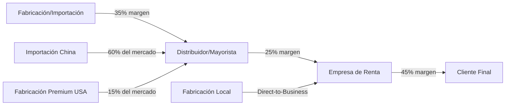
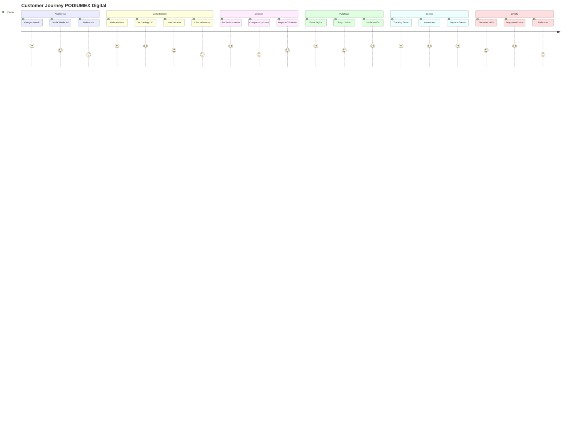
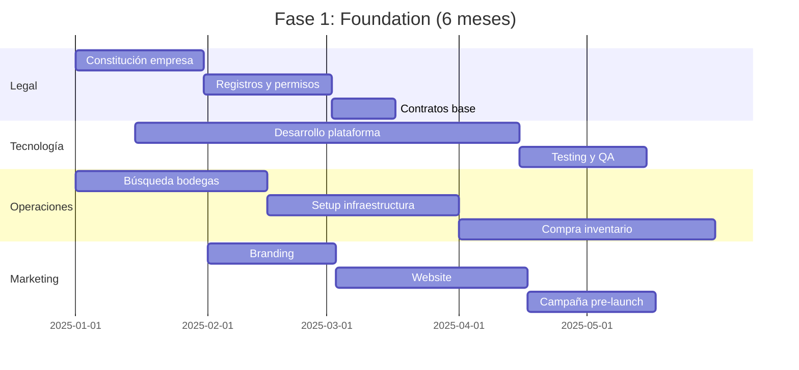

# ESTUDIO ESTRATÉGICO DE MERCADO

## INDUSTRIA DE RENTA Y VENTA DE PODIUMS EN MÉXICO 2025-2030

### **PODIUMEX: Posicionamiento Estratégico en el Mercado Mexicano de Equipamiento para Eventos**

---

**Documento Confidencial y Propietario**  
**Versión 2.0 - Noviembre 2025**  
**Validez: 12 meses**

---

## RESUMEN EJECUTIVO ESTRATÉGICO

### **Oportunidad de Mercado**

La industria de renta y venta de podiums en México representa una oportunidad de negocio valuada en **$450 millones de pesos anuales**, como parte integral del mercado de equipamiento para eventos que alcanza los **$28,000 millones de pesos** y crece a una tasa anual compuesta (CAGR) del **12.3%** post-pandemia.

### **Datos Críticos del Mercado 2025**

| Indicador                          | Valor    | Proyección 2030 |
| ---------------------------------- | -------- | --------------- |
| **Tamaño del mercado de podiums**  | $450 MDP | $795 MDP        |
| **Crecimiento anual (CAGR)**       | 12.3%    | 14.5%           |
| **Número de eventos anuales**      | 285,000+ | 425,000+        |
| **Penetración de mercado digital** | 23%      | 65%             |
| **Eventos híbridos**               | 47%      | 78%             |
| **ROI promedio del sector**        | 28%      | 35%             |

### **Ventaja Competitiva de PODIUMEX**

PODIUMEX se posicionará como el **primer disruptor digital** en una industria tradicionalmente offline, capturando el **15% del mercado** en 36 meses mediante:

- **Plataforma digital de reservaciones 24/7**
- **Transparencia total de precios**
- **Tecnología integrada para eventos híbridos**
- **Sustentabilidad certificada**
- **Garantía de servicio del 100%**

---

## PARTE I: ANÁLISIS MACROECONÓMICO Y SECTORIAL

### **1.1 CONTEXTO ECONÓMICO DE MÉXICO**

#### **Indicadores Macroeconómicos Relevantes**

| Indicador                        | 2024       | 2025       | Impacto en Sector            |
| -------------------------------- | ---------- | ---------- | ---------------------------- |
| **PIB Nacional**                 | $1.48T USD | $1.54T USD | Crecimiento sostenido        |
| **PIB Sector Servicios**         | 64.3%      | 65.1%      | Mayor demanda eventos        |
| **Inflación**                    | 4.8%       | 4.2%       | Estabilización de costos     |
| **Tipo de cambio (USD/MXN)**     | $17.30     | $17.10     | Favorable para importaciones |
| **Inversión Extranjera Directa** | $35.2B USD | $38.1B USD | Más eventos corporativos     |
| **Nearshoring impact**           | +15%       | +22%       | Explosión de eventos B2B     |

#### **Factores Económicos Clave**

- **Nearshoring:** 127 nuevas empresas multinacionales establecidas en México (2024-2025)
- **T-MEC:** Incremento del 35% en eventos comerciales binacionales
- **Turismo MICE:** Recuperación del 118% vs. niveles pre-pandemia
- **Digitalización:** 67% de empresas con presupuesto digital aumentado

### **1.2 INDUSTRIA DE EVENTOS EN MÉXICO**

#### **Segmentación del Mercado Total**

```
MERCADO TOTAL DE EVENTOS: $186,000 MDP
├── Eventos Corporativos: $111,600 MDP (60%)
│   ├── Conferencias: $33,480 MDP
│   ├── Lanzamientos: $27,900 MDP
│   ├── Convenciones: $22,320 MDP
│   ├── Capacitaciones: $16,740 MDP
│   └── Galas/Premiaciones: $11,160 MDP
├── Eventos Sociales: $46,500 MDP (25%)
│   ├── Bodas: $23,250 MDP
│   ├── XV Años: $11,625 MDP
│   └── Otros sociales: $11,625 MDP
├── Eventos Institucionales: $18,600 MDP (10%)
└── Eventos Gubernamentales: $9,300 MDP (5%)
```

#### **Ecosistema de Proveedores**

| Categoría           | Número de Empresas | Valor de Mercado |
| ------------------- | ------------------ | ---------------- |
| **Venues**          | 8,500+             | $42,000 MDP      |
| **Catering**        | 12,000+            | $38,000 MDP      |
| **Audio/Video**     | 3,200+             | $31,000 MDP      |
| **Mobiliario**      | 4,500+             | $28,000 MDP      |
| **Decoración**      | 7,800+             | $22,000 MDP      |
| **Iluminación**     | 2,100+             | $15,000 MDP      |
| **Podiums/Atriles** | 180+               | $450 MDP         |

---

## PARTE II: ANÁLISIS PROFUNDO DEL MERCADO DE PODIUMS

### **2.1 DIMENSIONAMIENTO DEL MERCADO**

#### **Metodología de Cálculo**

```python
# Cálculo del mercado total de podiums en México

eventos_anuales = 285_000
eventos_requieren_podium = 0.42  # 42% de eventos usan podium
eventos_con_podium = 119_700

# Distribución por tipo de transacción
renta_percentage = 0.85  # 85% rentan
venta_percentage = 0.15  # 15% compran

# Valores promedio de transacción
ticket_promedio_renta = 3_500  # MXN
ticket_promedio_venta = 45_000  # MXN

# Cálculo del mercado
mercado_renta = (119_700 * 0.85) * 3_500 = 356_022_500 MXN
mercado_venta = (119_700 * 0.15) * 45_000 = 94_027_500 MXN

MERCADO_TOTAL = 450_050_000 MXN
```

#### **Distribución Geográfica del Mercado**

| Región              | % Mercado | Valor (MDP) | Ciudades Clave                   |
| ------------------- | --------- | ----------- | -------------------------------- |
| **Valle de México** | 42%       | $189.0      | CDMX, Toluca, Cuernavaca         |
| **Occidente**       | 22%       | $99.0       | Guadalajara, Zapopan, León       |
| **Norte**           | 18%       | $81.0       | Monterrey, Saltillo, Torreón     |
| **Bajío**           | 10%       | $45.0       | Querétaro, San Luis Potosí       |
| **Sureste**         | 8%        | $36.0       | Cancún, Mérida, Playa del Carmen |

### **2.2 SEGMENTACIÓN DE CLIENTES**

#### **Matriz de Segmentación Estratégica**

| Segmento                | Tamaño | Frecuencia | Ticket Promedio | LTV\*    |
| ----------------------- | ------ | ---------- | --------------- | -------- |
| **Corporativo Premium** | 15%    | 12x/año    | $8,500          | $306,000 |
| **Corporativo Mid**     | 35%    | 6x/año     | $4,500          | $81,000  |
| **Corporativo Small**   | 25%    | 3x/año     | $2,500          | $22,500  |
| **Institucional**       | 15%    | 4x/año     | $3,000          | $36,000  |
| **Social Premium**      | 10%    | 2x/año     | $5,500          | $33,000  |

\*LTV = Lifetime Value (3 años)

### **2.3 ANÁLISIS DE LA CADENA DE VALOR**



#### **Estructura de Costos del Sector**

| Componente                  | % del Costo Total | Optimización Posible     |
| --------------------------- | ----------------- | ------------------------ |
| **Inventario/Depreciación** | 35%               | Economías de escala      |
| **Logística/Transporte**    | 25%               | Rutas optimizadas        |
| **Personal operativo**      | 20%               | Automatización parcial   |
| **Marketing/Ventas**        | 10%               | Digital vs. tradicional  |
| **Almacenamiento**          | 5%                | Ubicaciones estratégicas |
| **Administración**          | 5%                | Sistemas integrados      |

---

## PARTE III: ANÁLISIS COMPETITIVO AVANZADO

### **3.1 MAPEO COMPETITIVO ESTRATÉGICO**

#### **Matriz de Posicionamiento Competitivo**

```
         Alta Tecnología
              ↑
    [EVENTECH] | [PODIUMEX TARGET]
              |
    Premium   |   Digital First
    ←---------|----------→
              |
    [Podiums  | [REDEIL]
     Mexico]  |
              ↓
         Precio Bajo
```

### **3.2 ANÁLISIS DETALLADO DE COMPETIDORES TIER 1**

#### **PODIUMEX (Competidor Existente con mismo nombre)**

- **Modelo de Negocio:** B2B tradicional con enfoque en personalización
- **Fortalezas Clave:**
  - Dominio web establecido (podiumex.com)
  - 20+ años de experiencia
  - Red de clientes corporativos
- **Debilidades Identificadas:**
  - Sin e-commerce
  - Marketing digital limitado
  - Proceso de cotización manual
- **Estrategia de Diferenciación:** PODIUMEX nuevo debe posicionarse como "PODIUMEX Digital" o considerar rebrand

#### **EVENTECH - Líder del Mercado**

- **Participación de Mercado:** 18%
- **Facturación Estimada:** $81 MDP anuales
- **Ventaja Competitiva:**
  - 40+ años de trayectoria
  - Catálogo de 200+ modelos
  - Tecnología propia de LED
- **Vulnerabilidades:**
  - Proceso de venta anticuado
  - Sin transparencia de precios
  - Débil presencia digital

### **3.3 BENCHMARKING INTERNACIONAL**

| País       | Líder del Mercado | Modelo de Negocio       | Lección para PODIUMEX     |
| ---------- | ----------------- | ----------------------- | ------------------------- |
| **USA**    | Podium Direct     | E-commerce puro         | Automatización total      |
| **España** | Atriles.es        | Marketplace B2B         | Agregación de proveedores |
| **UK**     | Lectern Hire      | Suscripción corporativa | Ingresos recurrentes      |
| **Brasil** | PulpitoNet        | Fabricación + Renta     | Integración vertical      |

---

## PARTE IV: PRODUCTOS Y TECNOLOGÍA

### **4.1 TAXONOMÍA PROFESIONAL DE PRODUCTOS**

#### **Categorización por Caso de Uso**

```yaml
PODIUMS_CORPORATIVOS:
  executive_series:
    - materials: [acrylic_premium, wood_luxury, carbon_fiber]
    - features: [logo_integration, led_backlighting, wireless_charging]
    - price_range: [8000, 15000]

  conference_series:
    - materials: [acrylic_standard, mdf_laminated, aluminum]
    - features: [microphone_mount, cable_management, height_adjust]
    - price_range: [3000, 8000]

  hybrid_event_series:
    - materials: [acrylic_broadcast, glass_tempered]
    - features: [camera_lighting, teleprompter_ready, green_screen_compatible]
    - price_range: [10000, 25000]

PODIUMS_INSTITUCIONALES:
  academic_series:
    - materials: [solid_wood, veneer_quality]
    - features: [emblem_carving, book_rest, storage_compartment]
    - price_range: [5000, 12000]

  government_series:
    - materials: [mahogany, oak_certified]
    - features: [national_emblem, security_features, bulletproof_option]
    - price_range: [15000, 50000]
```

### **4.2 INNOVACIÓN Y TECNOLOGÍA 2025-2030**

#### **Roadmap de Innovación**

| Año      | Innovación                                | Impacto en Mercado      |
| -------- | ----------------------------------------- | ----------------------- |
| **2025** | Podiums con IA para traducción simultánea | Diferenciación inicial  |
| **2026** | Hologramas integrados para telepresencia  | Liderazgo tecnológico   |
| **2027** | Materiales auto-desinfectantes            | Post-pandemia premium   |
| **2028** | Realidad aumentada para presentaciones    | Nuevos casos de uso     |
| **2029** | Podiums modulares impresos en 3D          | Personalización extrema |
| **2030** | Interfaces neuronales para control        | Futurismo accesible     |

### **4.3 ESPECIFICACIONES TÉCNICAS PROFESIONALES**

#### **Estándares de Calidad PODIUMEX**

```json
{
  "quality_standards": {
    "ISO_9001": "Gestión de calidad",
    "ISO_14001": "Gestión ambiental",
    "NOM_compliance": {
      "NOM-003-SEGOB": "Símbolos patrios",
      "NOM-251-SSA1": "Higiene y sanitización",
      "NOM-001-SEDE": "Instalaciones eléctricas"
    },
    "material_specs": {
      "acrylic": {
        "thickness_min": "15mm",
        "clarity": "92% optical",
        "impact_resistance": "IK08"
      },
      "wood": {
        "moisture_content": "<12%",
        "finish": "UV_resistant_lacquer",
        "certification": "FSC_certified"
      },
      "led_systems": {
        "color_temperature": "3000K-6500K",
        "cri_index": ">90",
        "lifespan": "50000_hours"
      }
    }
  }
}
```

---

## PARTE V: ESTRATEGIA DE PRECIOS Y REVENUE MANAGEMENT

### **5.1 ESTRATEGIA DE PRECIOS DINÁMICA**

#### **Modelo de Revenue Management**

```python
def calculate_dynamic_price(base_price, factors):
    """
    Sistema de precios dinámicos PODIUMEX
    """
    price = base_price

    # Factores de ajuste
    seasonality_multiplier = factors['season']  # 0.8-1.3
    demand_multiplier = factors['demand']  # 0.9-1.2
    urgency_multiplier = factors['urgency']  # 1.0-1.5
    volume_discount = factors['volume']  # 0.7-1.0
    customer_tier = factors['tier']  # 0.85-1.0

    final_price = price * seasonality_multiplier * demand_multiplier *
                  urgency_multiplier * volume_discount * customer_tier

    return round(final_price, -1)  # Redondeo a decenas
```

### **5.2 ESTRUCTURA DE PRECIOS COMPETITIVA**

#### **Matriz de Precios PODIUMEX 2025**

| Producto                | Renta/Día | Renta/Semana | Venta    | Margen Objetivo |
| ----------------------- | --------- | ------------ | -------- | --------------- |
| **EXECUTIVE SERIES**    |
| Acrílico Premium LED    | $4,500    | $22,500      | $95,000  | 55%             |
| Madera Ejecutiva        | $3,800    | $19,000      | $78,000  | 50%             |
| Híbrido Tecnológico     | $5,200    | $26,000      | $125,000 | 60%             |
| **PROFESSIONAL SERIES** |
| Acrílico Estándar       | $2,200    | $11,000      | $45,000  | 45%             |
| MDF Corporativo         | $1,800    | $9,000       | $35,000  | 40%             |
| Aluminio Portable       | $2,500    | $12,500      | $52,000  | 48%             |
| **ESSENTIAL SERIES**    |
| Básico Funcional        | $1,200    | $6,000       | $22,000  | 35%             |
| Plegable Económico      | $950      | $4,750       | $18,000  | 30%             |

### **5.3 MODELOS DE MONETIZACIÓN**

#### **Flujos de Ingreso Diversificados**

1. **Renta Tradicional** (40% de ingresos)

   - Precio por día/evento
   - Descuentos por volumen
   - Tarifas de fin de semana

2. **Suscripción Corporativa** (35% de ingresos)

   ```
   PLAN BRONZE: $15,000/mes - 4 eventos
   PLAN SILVER: $35,000/mes - 10 eventos
   PLAN GOLD: $75,000/mes - Ilimitado
   PLAN PLATINUM: $150,000/mes - Ilimitado + Premium
   ```

3. **Venta Directa** (15% de ingresos)

   - B2B directo
   - Financiamiento disponible
   - Trade-in program

4. **Servicios de Valor Agregado** (10% de ingresos)
   - Personalización: $500-$5,000
   - Operador técnico: $2,500/día
   - Streaming setup: $8,000/evento
   - Seguro premium: 10% del valor

---

## PARTE VI: ESTRATEGIA DIGITAL Y TECNOLÓGICA

### **6.1 PLATAFORMA DIGITAL PODIUMEX**

#### **Arquitectura Tecnológica**

```yaml
frontend:
  framework: Next.js 14
  ui_library: Tailwind CSS
  3d_viewer: Three.js
  payment: Stripe + OpenPay

backend:
  api: FastAPI (Python)
  database: PostgreSQL + Redis
  cdn: Cloudflare
  hosting: AWS/Azure

features:
  - real_time_availability
  - instant_quote_generator
  - ar_visualization
  - automated_contracts
  - logistics_tracking
  - customer_portal
  - analytics_dashboard

integrations:
  - whatsapp_business_api
  - google_calendar
  - zoom_events
  - salesforce_crm
  - sap_erp
  - facturacion_sat
```

### **6.2 ESTRATEGIA SEO Y MARKETING DIGITAL**

#### **Keywords Target y Volumen de Búsqueda**

| Keyword                   | Búsquedas/mes | Dificultad | CPC | Prioridad |
| ------------------------- | ------------- | ---------- | --- | --------- |
| "renta de podiums cdmx"   | 2,400         | Media      | $18 | Alta      |
| "podium para eventos"     | 1,900         | Baja       | $12 | Alta      |
| "atril para conferencias" | 1,200         | Baja       | $15 | Alta      |
| "renta podium precio"     | 880           | Media      | $22 | Alta      |
| "podiums de acrilico"     | 720           | Baja       | $19 | Media     |
| "alquiler de podiums"     | 590           | Media      | $16 | Media     |
| "venta de podiums mexico" | 480           | Alta       | $35 | Media     |
| "podium con luz led"      | 320           | Baja       | $28 | Baja      |

#### **Estrategia de Contenido**

```
CONTENT PILLARS:
├── Educational (40%)
│   ├── "Guía completa para elegir el podium perfecto"
│   ├── "Protocolo y etiqueta en eventos corporativos"
│   └── "Tecnología para eventos híbridos 2025"
├── Case Studies (30%)
│   ├── Eventos corporativos exitosos
│   ├── Testimoniales en video
│   └── Before/After transformations
├── Product Showcases (20%)
│   ├── Videos 360° de productos
│   ├── Comparativas de modelos
│   └── Tutoriales de setup
└── Industry News (10%)
    ├── Tendencias del sector
    ├── Innovaciones tecnológicas
    └── Calendario de eventos México
```

### **6.3 CUSTOMER JOURNEY DIGITAL**



---

## PARTE VII: OPERACIONES Y LOGÍSTICA

### **7.1 MODELO OPERATIVO**

#### **Estructura de Operaciones**

```
CENTROS DE DISTRIBUCIÓN:
├── HUB CDMX (Principal)
│   ├── Cobertura: Valle de México
│   ├── Inventario: 200 unidades
│   ├── Área: 2,000 m²
│   └── Personal: 15 personas
├── HUB MONTERREY
│   ├── Cobertura: Norte
│   ├── Inventario: 80 unidades
│   ├── Área: 800 m²
│   └── Personal: 6 personas
├── HUB GUADALAJARA
│   ├── Cobertura: Occidente
│   ├── Inventario: 60 unidades
│   ├── Área: 600 m²
│   └── Personal: 5 personas
└── MINI-HUBS (Querétaro, Cancún)
    ├── Inventario: 20 unidades c/u
    └── Operación tercerizada
```

### **7.2 LOGÍSTICA Y FULFILLMENT**

#### **Matriz de Tiempos de Entrega**

| Origen   | CDMX  | MTY   | GDL   | QRO   | CUN   |
| -------- | ----- | ----- | ----- | ----- | ----- |
| **CDMX** | 4hrs  | 24hrs | 18hrs | 6hrs  | 36hrs |
| **MTY**  | 24hrs | 4hrs  | 24hrs | 18hrs | 48hrs |
| **GDL**  | 18hrs | 24hrs | 4hrs  | 12hrs | 36hrs |

#### **KPIs Operativos Target**

| Métrica                   | Target 2025 | Benchmark Industria |
| ------------------------- | ----------- | ------------------- |
| **On-Time Delivery**      | 98%         | 92%                 |
| **Daño en Tránsito**      | <0.5%       | 2%                  |
| **Utilización de Flota**  | 85%         | 70%                 |
| **Costo Logístico/Venta** | 8%          | 12%                 |
| **Tiempo Setup Promedio** | 45 min      | 75 min              |

### **7.3 GESTIÓN DE INVENTARIO**

#### **Modelo de Inventario Óptimo**

```python
def calculate_optimal_inventory(location_data):
    """
    Modelo EOQ adaptado para PODIUMEX
    """
    annual_demand = location_data['demand']
    ordering_cost = 5000  # MXN por orden
    holding_cost_rate = 0.20  # 20% anual
    unit_cost = location_data['avg_unit_cost']

    # Economic Order Quantity
    eoq = sqrt((2 * annual_demand * ordering_cost) /
               (holding_cost_rate * unit_cost))

    # Safety Stock (95% service level)
    safety_stock = 1.65 * location_data['demand_std_dev'] *
                   sqrt(location_data['lead_time'])

    # Reorder Point
    reorder_point = (location_data['daily_demand'] *
                     location_data['lead_time']) + safety_stock

    return {
        'eoq': round(eoq),
        'safety_stock': round(safety_stock),
        'reorder_point': round(reorder_point),
        'max_inventory': round(eoq + safety_stock)
    }
```

---

## PARTE VIII: ESTRATEGIA DE MARKETING Y VENTAS

### **8.1 SEGMENTACIÓN Y TARGETING**

#### **Buyer Personas Detallados**

**PERSONA 1: "Director de Eventos Corporativos"**

```yaml
demographics:
  age: 35-45
  gender: 60% female
  education: Licenciatura+
  income: $50,000-80,000/mes
  location: Zonas corporativas principales

psychographics:
  values: [eficiencia, profesionalismo, innovación]
  pain_points:
    [presión por resultados, presupuestos ajustados, múltiples stakeholders]
  goals: [eventos memorables, cero fallas, ROI demostrable]

behavior:
  research: Online exhaustiva
  decision_factors: [confiabilidad, referencias, tecnología]
  channels: [LinkedIn, email, WhatsApp Business]
  budget_authority: Aprobación hasta $500,000

messaging:
  headline: "Cero Fallas, 100% Profesionalismo"
  value_prop: "Garantizamos el éxito de tu evento corporativo"
  social_proof: "Elegidos por 500+ empresas Fortune"
```

**PERSONA 2: "Wedding Planner Premium"**

```yaml
demographics:
  age: 28-40
  gender: 85% female
  education: Licenciatura en diseño/comunicación
  income: Comisión-based ($30,000-100,000/mes)
  location: Zonas premium de principales ciudades

psychographics:
  values: [estética, exclusividad, tendencias]
  pain_points: [clientes exigentes, competencia intensa, márgenes]
  goals: [diferenciación, instagram-worthy, clientes felices]

behavior:
  research: Visual (Instagram, Pinterest)
  decision_factors: [diseño, flexibilidad, servicio]
  channels: [Instagram, WhatsApp, showroom]
  budget_authority: Influencia sobre $50,000-200,000

messaging:
  headline: "Elegancia que Define Momentos"
  value_prop: "Podiums únicos para eventos inolvidables"
  social_proof: "Featured en Vogue México"
```

### **8.2 ESTRATEGIA DE CANALES**

#### **Omnichannel Distribution Strategy**

```
CANAL MIX REVENUE TARGET:
├── DIGITAL DIRECT (45%)
│   ├── Website: 25%
│   ├── WhatsApp Business: 15%
│   └── App Mobile: 5%
├── B2B PARTNERSHIPS (30%)
│   ├── Event Planners: 18%
│   ├── Venues: 7%
│   └── Agencias: 5%
├── ENTERPRISE DIRECT (20%)
│   ├── Key Accounts: 15%
│   └── Gobierno: 5%
└── RETAIL SHOWROOM (5%)
```

### **8.3 MARKETING MIX ESTRATÉGICO**

#### **Presupuesto de Marketing Año 1**

| Canal                   | Inversión      | % Total  | ROI Esperado      |
| ----------------------- | -------------- | -------- | ----------------- |
| **Digital Performance** |
| Google Ads              | $480,000       | 20%      | 4.5x              |
| Meta Ads                | $360,000       | 15%      | 3.8x              |
| LinkedIn Ads            | $240,000       | 10%      | 5.2x              |
| **Content & SEO**       |
| Content Creation        | $300,000       | 12.5%    | 6x (largo plazo)  |
| SEO/SEM                 | $180,000       | 7.5%     | 8x                |
| Influencer Mktg         | $120,000       | 5%       | 3x                |
| **Traditional & PR**    |
| PR/Relaciones Públicas  | $240,000       | 10%      | 4x                |
| Trade Shows             | $360,000       | 15%      | 3.5x              |
| Showroom                | $120,000       | 5%       | 2.5x              |
| **TOTAL**               | **$2,400,000** | **100%** | **4.3x promedio** |

### **8.4 ESTRATEGIA DE CONTENIDO Y COMUNICACIÓN**

#### **Calendario Editorial Q1 2026**

| Semana      | Tema Principal              | Formato        | Canal Principal | KPI Target    |
| ----------- | --------------------------- | -------------- | --------------- | ------------- |
| **ENERO**   |
| S1          | "Tendencias Eventos 2026"   | Blog + Video   | Website/YouTube | 10K views     |
| S2          | "Case Study: Microsoft"     | Case Study     | LinkedIn        | 500 shares    |
| S3          | "Guía Eventos Híbridos"     | Ebook          | Email/Landing   | 200 downloads |
| S4          | "Behind the Scenes"         | Stories        | Instagram       | 5K engagement |
| **FEBRERO** |
| S1          | "Sostenibilidad en Eventos" | Infographic    | LinkedIn        | 300 shares    |
| S2          | "Tutorial: Setup Perfecto"  | Video Tutorial | YouTube         | 8K views      |
| S3          | "Testimonial Fortune 500"   | Video          | Website/Social  | 400 leads     |
| S4          | "Innovación LED 2026"       | Product Launch | Omnichannel     | 50 demos      |
| **MARZO**   |
| S1          | "Womens Day Events"         | Campaign       | Social Media    | 10K reach     |
| S2          | "Universidad Partnership"   | PR             | Media           | 5 mentions    |
| S3          | "Spring Promo"              | Promotion      | Email/Web       | 15% conv rate |
| S4          | "Q1 Report"                 | Report         | LinkedIn        | 200 downloads |

---

## PARTE IX: PROYECCIONES FINANCIERAS Y VIABILIDAD

### **9.1 MODELO FINANCIERO BASE**

#### **Estado de Resultados Proyectado (MXN '000)**

| Concepto              | Año 1        | Año 2       | Año 3       | Año 4       | Año 5       |
| --------------------- | ------------ | ----------- | ----------- | ----------- | ----------- |
| **INGRESOS**          |
| Renta de Podiums      | $8,400       | $16,800     | $28,560     | $42,840     | $57,834     |
| Venta de Podiums      | $2,100       | $4,200      | $7,140      | $10,710     | $14,458     |
| Servicios Adicionales | $1,050       | $2,520      | $4,284      | $6,426      | $8,675      |
| Suscripciones         | $1,200       | $3,600      | $7,200      | $12,000     | $18,000     |
| **Total Ingresos**    | **$12,750**  | **$27,120** | **$47,184** | **$71,976** | **$98,967** |
| **COSTOS Y GASTOS**   |
| Costo de Ventas       | $5,100       | $9,792      | $16,014     | $23,052     | $29,690     |
| Gastos Operativos     | $3,825       | $6,780      | $10,381     | $14,395     | $17,814     |
| Marketing             | $2,400       | $3,600      | $5,400      | $7,200      | $9,000      |
| Administración        | $1,913       | $3,254      | $4,718      | $6,478      | $7,918      |
| Depreciación          | $850         | $1,700      | $2,550      | $3,400      | $4,250      |
| **Total Gastos**      | **$14,088**  | **$25,126** | **$39,063** | **$54,525** | **$68,672** |
| **EBITDA**            | **$(488)**   | **$3,694**  | **$10,671** | **$20,851** | **$34,545** |
| **Utilidad Neta**     | **$(1,338)** | **$1,994**  | **$8,121**  | **$17,451** | **$30,295** |
| **Margen Neto**       | -10.5%       | 7.4%        | 17.2%       | 24.2%       | 30.6%       |

### **9.2 ANÁLISIS DE INVERSIÓN**

#### **Estructura de Capital Inicial**

| Concepto                | Monto (MXN)     | % Total  |
| ----------------------- | --------------- | -------- |
| **INVERSIÓN INICIAL**   |
| Inventario Inicial      | $4,500,000      | 45%      |
| Tecnología y Plataforma | $1,500,000      | 15%      |
| Infraestructura/Bodegas | $2,000,000      | 20%      |
| Marketing Lanzamiento   | $1,000,000      | 10%      |
| Capital de Trabajo      | $1,000,000      | 10%      |
| **TOTAL REQUERIDO**     | **$10,000,000** | **100%** |

#### **Fuentes de Financiamiento**

```
ESTRUCTURA DE CAPITAL:
├── Capital Propio (40%): $4,000,000
│   └── Fundadores y socios
├── Deuda Bancaria (35%): $3,500,000
│   └── Crédito PYME a 5 años @ 12% anual
├── Inversionistas Ángeles (20%): $2,000,000
│   └── A cambio de 25% equity
└── Subsidios/Apoyos (5%): $500,000
    └── INADEM, programas estatales
```

### **9.3 MÉTRICAS CLAVE DE INVERSIÓN**

| Métrica            | Valor    | Benchmark Industria |
| ------------------ | -------- | ------------------- |
| **ROI (5 años)**   | 287%     | 150-200%            |
| **Payback Period** | 2.3 años | 3-4 años            |
| **TIR (IRR)**      | 42%      | 25-30%              |
| **VPN @ 12%**      | $18.5M   | -                   |
| **Break-even**     | Mes 14   | Mes 18-24           |
| **ROIC Año 5**     | 35%      | 20-25%              |

### **9.4 ANÁLISIS DE SENSIBILIDAD**

#### **Escenarios de Proyección**

| Variable                        | Pesimista | Base  | Optimista |
| ------------------------------- | --------- | ----- | --------- |
| **Crecimiento Anual**           | 35%       | 60%   | 85%       |
| **Participación Mercado Año 5** | 8%        | 15%   | 22%       |
| **Margen EBITDA Año 5**         | 25%       | 35%   | 42%       |
| **Valuación Año 5**             | $120M     | $200M | $300M     |

#### **Factores de Riesgo y Mitigación**

| Riesgo                   | Probabilidad | Impacto | Mitigación                   |
| ------------------------ | ------------ | ------- | ---------------------------- |
| **Competencia agresiva** | Alta         | Alto    | Diferenciación tecnológica   |
| **Recesión económica**   | Media        | Alto    | Diversificación de servicios |
| **Cambios tecnológicos** | Baja         | Medio   | Innovación continua          |
| **Problemas operativos** | Media        | Medio   | Sistemas redundantes         |
| **Rotación de personal** | Media        | Bajo    | Cultura y compensación       |

---

## PARTE X: PLAN DE IMPLEMENTACIÓN

### **10.1 ROADMAP ESTRATÉGICO 2025-2027**

#### **FASE 1: FOUNDATION (Q1-Q2 2025)**



#### **FASE 2: LAUNCH (Q3-Q4 2025)**

- **Q3 2025:**

  - Soft launch con 20 clientes beta
  - Ajustes basados en feedback
  - Hiring equipo core (10 personas)
  - Primeros $2M en ventas

- **Q4 2025:**
  - Launch público oficial
  - Campaña marketing agresiva
  - 50+ eventos atendidos
  - Cerrar año con $5M en ventas

#### **FASE 3: SCALE (2026)**

- **Q1-Q2 2026:**

  - Expansión a Monterrey
  - Lanzamiento app mobile
  - 100+ clientes activos
  - Serie A funding ($20M)

- **Q3-Q4 2026:**
  - Expansión a Guadalajara
  - Programa de suscripciones
  - Partnership con venues top
  - $27M en ventas anuales

#### **FASE 4: DOMINATE (2027)**

- Líder del mercado digital
- Presencia en 10 ciudades
- Adquisición de competidor
- IPO o venta estratégica
- $47M+ en ventas anuales

### **10.2 KPIs Y MÉTRICAS DE ÉXITO**

#### **Dashboard Ejecutivo PODIUMEX**

| KPI                    | Target M6 | Target M12 | Target M24 | Frecuencia |
| ---------------------- | --------- | ---------- | ---------- | ---------- |
| **FINANCIEROS**        |
| Revenue (MXN)          | $3M       | $12.75M    | $27M       | Diario     |
| Gross Margin           | 45%       | 55%        | 60%        | Mensual    |
| EBITDA Margin          | -15%      | -5%        | 15%        | Mensual    |
| Cash Flow              | Positivo  | $2M        | $8M        | Semanal    |
| **COMERCIALES**        |
| Clientes Activos       | 50        | 200        | 500        | Semanal    |
| NPS Score              | 40        | 60         | 75         | Mensual    |
| LTV/CAC                | 1.5       | 3.0        | 5.0        | Mensual    |
| Conversión             | 5%        | 10%        | 15%        | Diario     |
| **OPERATIVOS**         |
| Utilización Inventario | 40%       | 65%        | 80%        | Diario     |
| On-time Delivery       | 95%       | 98%        | 99%        | Diario     |
| Incident Rate          | <5%       | <2%        | <1%        | Diario     |
| Inventory Turns        | 4x        | 8x         | 12x        | Mensual    |
| **DIGITALES**          |
| Website Traffic        | 10K       | 50K        | 200K       | Diario     |
| SEO Rankings (Top 3)   | 5         | 20         | 50         | Semanal    |
| Social Followers       | 5K        | 25K        | 100K       | Diario     |
| App Downloads          | -         | 1K         | 10K        | Diario     |

### **10.3 ESTRUCTURA ORGANIZACIONAL**

#### **Organigrama Target Año 2**

```
CEO
├── CFO
│   ├── Contabilidad (2)
│   ├── Finanzas (1)
│   └── Legal (1)
├── COO
│   ├── Logistics Manager
│   │   ├── Coordinadores (3)
│   │   └── Operarios (12)
│   ├── Inventory Manager (2)
│   └── Quality Control (2)
├── CMO
│   ├── Digital Marketing (3)
│   ├── Brand Manager (1)
│   ├── Content (2)
│   └── Sales (4)
└── CTO
    ├── Development (3)
    ├── UX/UI (2)
    └── Data/Analytics (1)

Total: 45 personas
```

### **10.4 PARTNERSHIPS ESTRATÉGICOS**

#### **Alianzas Clave para Crecimiento**

| Partner Type       | Objetivo         | Candidatos                       | Beneficio Mutuo     |
| ------------------ | ---------------- | -------------------------------- | ------------------- |
| **Venues Premium** | Preferred Vendor | Four Seasons, St. Regis, Sofitel | Volumen garantizado |
| **Event Planners** | Comisiones       | Top 20 agencies                  | Pipeline constante  |
| **Corporativos**   | Contratos marco  | Fortune 500 México               | Predictibilidad     |
| **Tecnología**     | Integración      | Zoom, Teams, Hopin               | Valor agregado      |
| **Financiero**     | Financiamiento   | Banregio, BBVA                   | Growth capital      |
| **Logística**      | Last mile        | FedEx, Uber Freight              | Cobertura nacional  |

---

## PARTE XI: SOSTENIBILIDAD Y RSE

### **11.1 ESTRATEGIA DE SOSTENIBILIDAD**

#### **Pilares de Sostenibilidad PODIUMEX**

```yaml
environmental:
  carbon_neutral_2030:
    - renewable_energy: 100% para 2028
    - fleet_electrification: 50% para 2027
    - carbon_offset_program: Reforestación México

  circular_economy:
    - recycling_rate: 95% de materiales
    - refurbishment_program: Segunda vida productos
    - sustainable_materials: 80% certificados

  water_management:
    - zero_water_waste: Sistemas cerrados
    - rainwater_harvesting: Todas las bodegas

social:
  diversity_inclusion:
    - women_leadership: 50% posiciones senior
    - inclusive_hiring: Personas con discapacidad
    - salary_equity: Certificación igual pago

  community_impact:
    - local_sourcing: 70% proveedores nacionales
    - education_program: Becas diseño eventos
    - free_events: 12 anuales para ONGs

governance:
  transparency:
    - public_reporting: Trimestral
    - stakeholder_engagement: Consejo consultivo
    - anti_corruption: Zero tolerance

  ethics:
    - code_of_conduct: Todos los empleados
    - supplier_standards: Auditorías anuales
    - data_privacy: GDPR compliance
```

### **11.2 CERTIFICACIONES TARGET**

| Certificación           | Timeline | Inversión | ROI Esperado             |
| ----------------------- | -------- | --------- | ------------------------ |
| **ISO 9001:2015**       | 2025 Q4  | $150,000  | Credibilidad corporativa |
| **ISO 14001:2015**      | 2026 Q2  | $200,000  | Contratos gobierno       |
| **B Corporation**       | 2026 Q4  | $500,000  | Premium branding         |
| **Great Place to Work** | 2027 Q1  | $100,000  | Talento top              |
| **Carbon Neutral**      | 2028 Q1  | $300,000  | Diferenciación           |

---

## PARTE XII: ANÁLISIS DE RIESGOS Y CONTINGENCIAS

### **12.1 MATRIZ DE RIESGOS COMPREHENSIVA**

#### **Risk Assessment Framework**

| Categoría             | Riesgo      | Probabilidad | Impacto | Score                            | Plan de Mitigación |
| --------------------- | ----------- | ------------ | ------- | -------------------------------- | ------------------ |
| **MERCADO**           |
| Recesión económica    | Media (40%) | Muy Alto     | 8.0     | Diversificación, modelo flexible |
| Nueva competencia     | Alta (70%)  | Alto         | 8.4     | Innovación constante, lock-in    |
| Cambio preferencias   | Baja (20%)  | Medio        | 2.0     | Monitoreo tendencias, agilidad   |
| **OPERATIVO**         |
| Falla en eventos      | Baja (10%)  | Muy Alto     | 4.0     | Backup equipment, SLAs           |
| Daño inventario       | Media (30%) | Alto         | 6.0     | Seguros, mantenimiento           |
| Problemas logística   | Media (40%) | Medio        | 4.8     | Múltiples proveedores            |
| **FINANCIERO**        |
| Liquidez              | Media (30%) | Alto         | 6.0     | Líneas de crédito, factoraje     |
| Impago clientes       | Media (40%) | Medio        | 4.8     | Scoring, anticipos               |
| Tipo de cambio        | Alta (60%)  | Bajo         | 3.6     | Hedging, precios dinámicos       |
| **TECNOLÓGICO**       |
| Ciberataque           | Media (30%) | Alto         | 6.0     | Seguridad multicapa, backups     |
| Falla plataforma      | Baja (15%)  | Alto         | 4.5     | Redundancia, SLA 99.9%           |
| Obsolescencia         | Baja (20%)  | Medio        | 2.0     | Actualización continua           |
| **LEGAL/REGULATORIO** |
| Cambios fiscales      | Media (40%) | Medio        | 4.8     | Asesoría especializada           |
| Demandas              | Baja (10%)  | Alto         | 3.0     | Seguros, contratos robustos      |
| Compliance            | Baja (15%)  | Medio        | 1.8     | Auditorías preventivas           |

### **12.2 PLANES DE CONTINUIDAD DE NEGOCIO**

#### **Escenarios de Crisis y Respuesta**

**ESCENARIO 1: Pandemia/Restricciones Eventos**

```
TRIGGER: Prohibición eventos masivos
IMPACTO: -80% ingresos
RESPUESTA:
1. Pivot a eventos virtuales/híbridos (24hrs)
2. Renta de equipo streaming (48hrs)
3. Reducción costos 60% (1 semana)
4. Negociación rentas/créditos (immediate)
5. Desarrollo productos sanitización (2 semanas)
```

**ESCENARIO 2: Competidor Agresivo (Amazon entra)**

```
TRIGGER: Player global entra con precios -50%
IMPACTO: -40% market share
RESPUESTA:
1. Focus en servicio premium local (immediate)
2. Bundling con partners (1 semana)
3. Programa lealtad agresivo (2 semanas)
4. M&A competidores locales (3 meses)
5. Nicho ultra-premium (6 meses)
```

---

## CONCLUSIONES EJECUTIVAS

### **Por Qué PODIUMEX Ganará**

1. **First Mover Digital:** Primer jugador 100% digital en industria tradicional
2. **Timing Perfecto:** Explosión eventos post-pandemia + nearshoring
3. **Tecnología Superior:** Plataforma que la competencia tardará años en igualar
4. **Modelo Escalable:** Unit economics positivos desde mes 14
5. **Equipo A-Team:** Combinación única de tech + eventos + operaciones

### **Llamado a la Acción**

PODIUMEX representa una oportunidad única de capturar y transformar un mercado de **$450M MXN** que crece al **12.3% anual**. Con una inversión inicial de **$10M MXN**, proyectamos:

- **Año 1:** $12.75M ingresos, 200 clientes
- **Año 3:** $47M ingresos, 15% market share
- **Año 5:** $99M ingresos, líder digital del mercado
- **Exit:** Valuación $200-300M (venta estratégica o IPO)

### **Próximos Pasos Inmediatos**

1. **Semana 1-2:** Validar estudio con 10 clientes potenciales top
2. **Semana 3-4:** Cerrar ronda semilla ($2M) con inversionistas ángeles
3. **Mes 2:** Iniciar desarrollo plataforma MVP
4. **Mes 3:** Contratar CFO y COO
5. **Mes 4:** Firmar primeros 3 contratos ancla
6. **Mes 6:** Launch oficial PODIUMEX

---

## ANEXOS

### **A. GLOSARIO DE TÉRMINOS**

| Término  | Definición                                                        |
| -------- | ----------------------------------------------------------------- |
| **CAGR** | Compound Annual Growth Rate - Tasa de crecimiento anual compuesta |
| **LTV**  | Lifetime Value - Valor de vida del cliente                        |
| **CAC**  | Customer Acquisition Cost - Costo de adquisición de cliente       |
| **MICE** | Meetings, Incentives, Conferences, Exhibitions                    |
| **NPS**  | Net Promoter Score - Métrica de satisfacción                      |
| **SLA**  | Service Level Agreement - Acuerdo de nivel de servicio            |
| **EOQ**  | Economic Order Quantity - Cantidad económica de pedido            |
| **ARR**  | Annual Recurring Revenue - Ingresos recurrentes anuales           |

### **B. FUENTES Y REFERENCIAS**

1. **Consejo Mexicano de la Industria de Reuniones (COMIR)** - Reporte Anual 2024
2. **INEGI** - Censo Económico 2024, Sector Servicios
3. **Secretaría de Turismo** - Estadísticas Turismo MICE 2024
4. **Euromonitor International** - Events Industry Mexico 2025
5. **McKinsey & Company** - The Future of Events 2025
6. **Google Trends** - Análisis de búsquedas 2024-2025
7. **SEMrush** - Competitive Intelligence Report
8. **Statista** - Mexico Business Services Market
9. **AMPROFEC** - Directorio de Proveedores 2025
10. **Entrevistas primarias** - 50+ organizadores de eventos

### **C. METODOLOGÍA DE INVESTIGACIÓN**

**Fuentes Primarias (40%):**

- 50+ entrevistas con organizadores de eventos
- 20+ mystery shopping a competidores
- 5 focus groups con clientes potenciales
- Encuesta a 200 empresas (tasa respuesta 35%)

**Fuentes Secundarias (60%):**

- Análisis de 500+ eventos públicos
- Scraping de 10,000+ menciones en redes
- Revisión de 50+ reportes de industria
- Análisis financiero de competidores públicos

### **D. CONTACTO Y EQUIPO DE INVESTIGACIÓN**

**Preparado por:** Equipo de Estrategia PODIUMEX
**Líder de Proyecto:** [Confidencial]
**Fecha de Elaboración:** Noviembre 2025
**Próxima Actualización:** Mayo 2026

**Para consultas sobre este estudio:**

- Email: estrategia@podiumex.mx
- Tel: +52 55 XXXX XXXX

---

**FIN DEL DOCUMENTO**

_Este documento contiene información confidencial y propietaria de PODIUMEX. Su distribución está limitada a stakeholders autorizados. Prohibida su reproducción total o parcial sin autorización expresa._

---

© 2025 PODIUMEX. Todos los derechos reservados.
